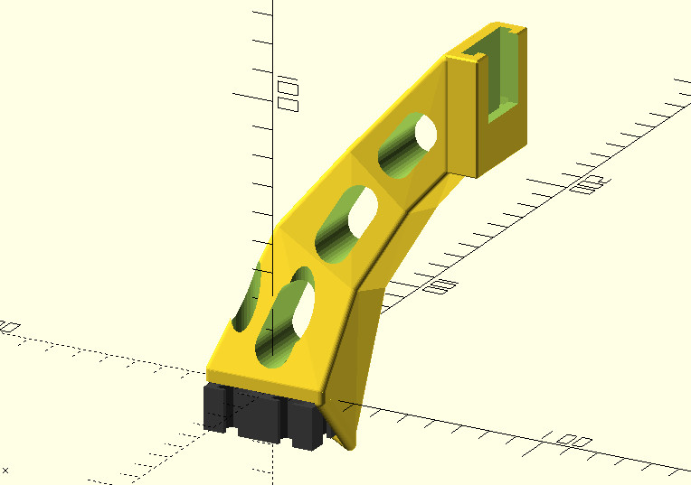
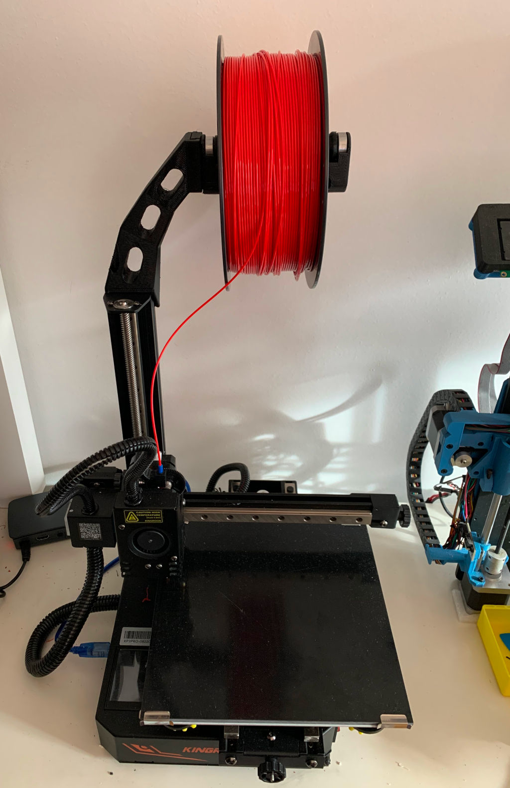

# openscad-kp3spro-filler

This is a [Kingroon KP3S Pro](https://taoofmac.com/space/blog/2023/01/22/1700) mounting arm for the [Filler](https://www.thingiverse.com/thing:3020026) customizable spool holder:

It is designed to mount on top of the Z-axis 2040 extrusion and be held in place by the existing screws while placing most of the actual load on the extrusion itself. 

The end result looks like this with a [Filler](https://www.thingiverse.com/thing:3020026) roller in place:

## Notes

* This includes `filler-profile-brace.scad` from [this Thingiverse project](https://www.thingiverse.com/thing:3359262) for your convenience. I don't remember where I got the aluminum extrusion code from, will update this if I find out.
* Screw holes and tolerances were defined for `PETG`, so your mileage may vary.
* Screw holes are also a bit of a compromise since I could not shift the spool further back (which would have helped with the bottom arm segment).
* This may be a little over-engineered. The arm might be made slightly thinner, but I wanted it to spread load to both the extrusion corner (downward force) and the outer screw (side and upwards tension).
* If you're using [Klipper](klipper3d.org/), make sure to re-run input shaping with a full spool after mounting this, since regardless of how rigid the printer frame is you are effectively adding an inverted pendulum to it.
